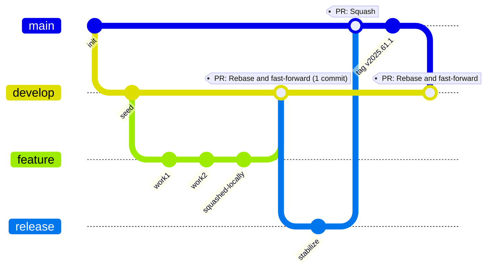
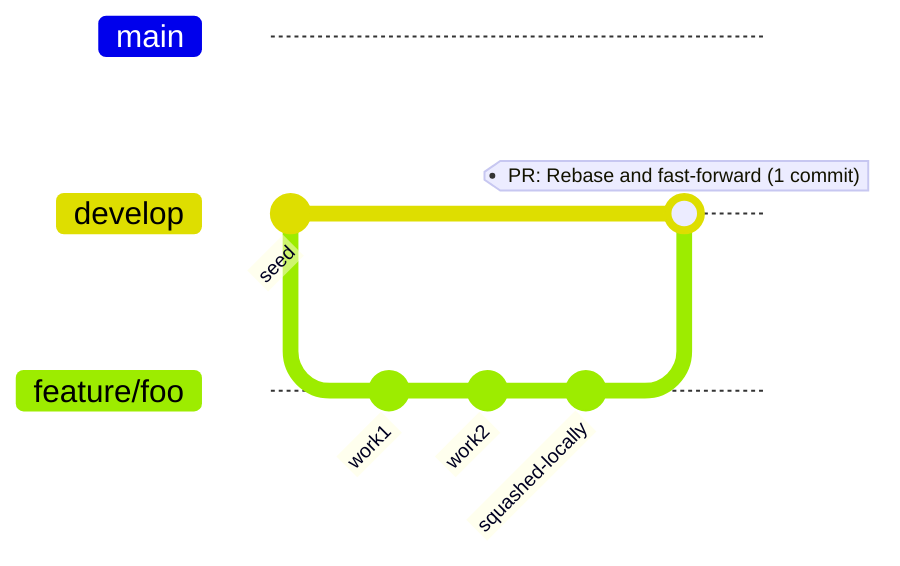
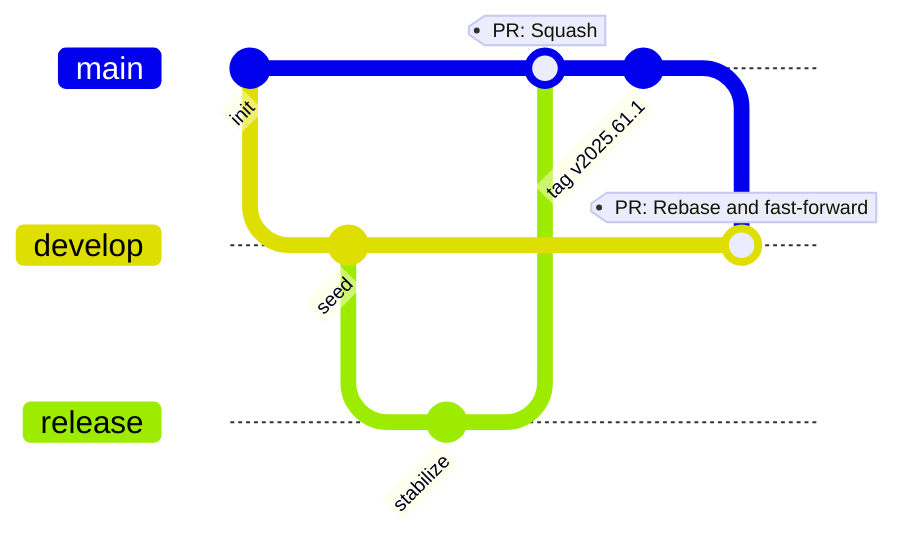
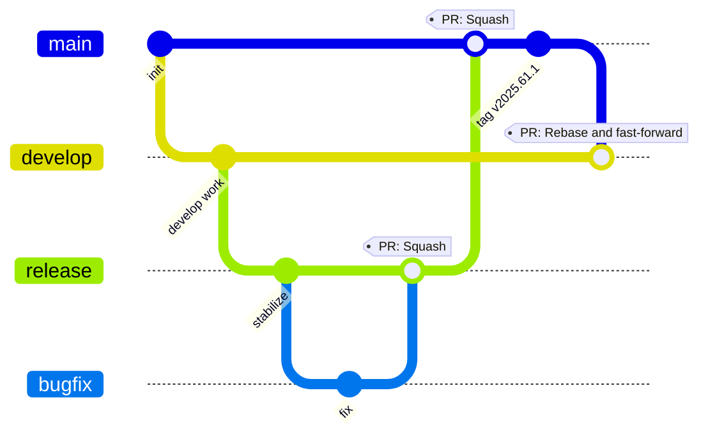

# GitFlow — Hands-On Runbook

Goals: keep main linear, develop clean, avoid recurring conflicts, and always record conflict resolutions where
they belong.

## Branching model - GitFlow
* Long-lived branches: main, develop, release/\*
* Short-lived branches: feature/\*

**Note** Ideally release branches are also short-lived, but ING policy does not allow release branches to be deleted.



## One-time setup
```
git config --global rerere.enabled true     # remember conflict resolutions
git config --global pull.rebase false       # never rebase shared branches by default
git fetch --all --prune
```

## 1) Feature development
Branch from develop, keep rebasing on latest develop, squash before PR.

### 1.1) steps for creating and working on feature branch
```
git fetch --all --prune
git switch -c feature/my-feature origin/develop

# … do work, commit as needed …

# keep up to date during development
git fetch origin
git rebase origin/develop

# squash to one commit before publishing
git rebase -i origin/develop

# keep only the first row to "pick", put the other lines to "squash"
# to do this all in one go, enter this command:
# :2,$s/^pick/squash/

git push -u origin feature/my-feature --force-with-lease
```

### 1.2) feature → develop

Azure DevOps PR (feature → develop)
* Target/base: develop
* Source/compare: feature/my-feature
* Complete PR → Merge type: Rebase and fast-forward

(Result: exactly one commit lands on develop.)

### Diagram of feature development



## 2) Release process
Cut a release branch from develop, stabilize it with small fixes, finish the release into main as one squashed commit, 
then immediately back-merge main → develop to prevent drift.

### 2.1) Cut the release branch
```
git fetch --all --prune
git switch -c release/2025.61.1 origin/develop

# Optional: bump version/changelog
git commit -am "chore(release): bump version to 2025.61.1"

git push -u origin release/2025.61.1
```

#### 2.1.1) Stabilize on the release branch (if necessary)

Create short-lived fix branches from the release (not develop), and PR them back into the release.

```
git switch -c bugfix/issue-123 origin/release/2025.61.1
# ... implement fix ...
git commit -am "fix: issue 123"
git push -u origin bugfix/issue-123
```

#### 2.1.2) bugfix → release (if necessary)

Azure DevOps PR (bugfix → release)
* Target/base: release
* Source/compare: bugfix/issue-123
* Merge type: Squash

Repeat steps 2.1.1 and 2.1.2 as needed until the release is ready.

### 2.2 Integrate main into the release before finishing
```
git fetch --all --prune

git switch -c release-integration-2025.61.1 origin/release/2025.61.1
git merge --no-ff origin/main    # expect conflicts if histories diverged
# resolve
git add -A
git commit -m "Merge main into release/2025.61.1 to record conflict resolutions"
git push -u origin release-integration-2025.61.1
```

Azure DevOps PR (integration → release)
* Target/base: release/2025.61.1
* Source/compare: release-integration-2025.61.1
* Merge type: Merge (create a merge commit; do not squash/rebase)

### 2.3) release → main

When ready to release:

Azure DevOps PR (release → main)
•	Target/base: main
•	Source/compare: release/2025.61.1
•	Merge type: Squash
•	Use a clear release commit message

### 2.4) Immediately back-merge main → develop

Prevent drift between long-lived branches, check to see you are in good shape:
```
git fetch --all --prune
git rev-list --left-right --count origin/develop...origin/main
# Ideally shows: 0 1  (develop behind main by the one release commit)
```

#### 2.4.1) main → develop

Azure DevOps PR (main → develop)
* Target/base: develop
* Source/compare: main
* Merge type: Rebase and fast-forward

### Diagram of regular release



### Diagram of release with bugfix in between


### 2.5) Rebase open feature branches on updated develop

Each open feature branch must be rebased on the new develop so its history is clean and PRs don’t reintroduce old commits.

Repeat per feature:
```
git fetch --all --prune
git switch feature/your-branch
git rebase origin/develop
# resolve → git add -A ; git rebase --continue
git rebase -i origin/develop     # squash to one commit
git push --force-with-lease
```
