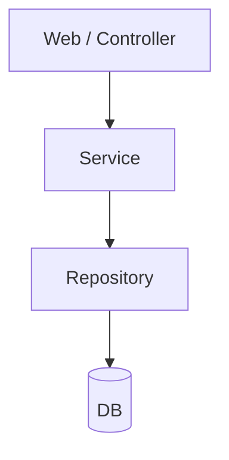
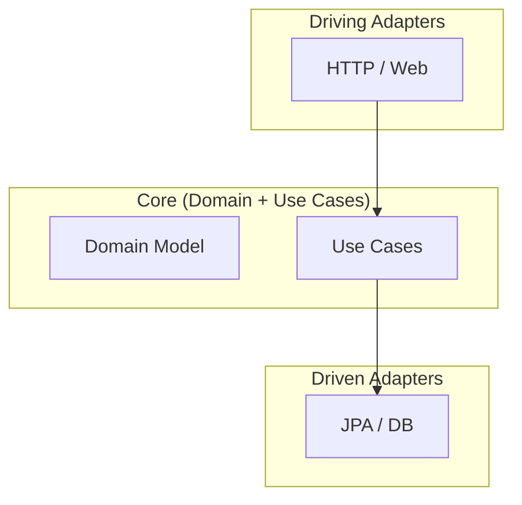
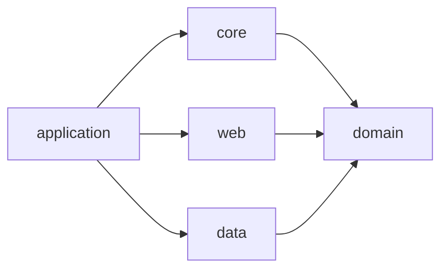
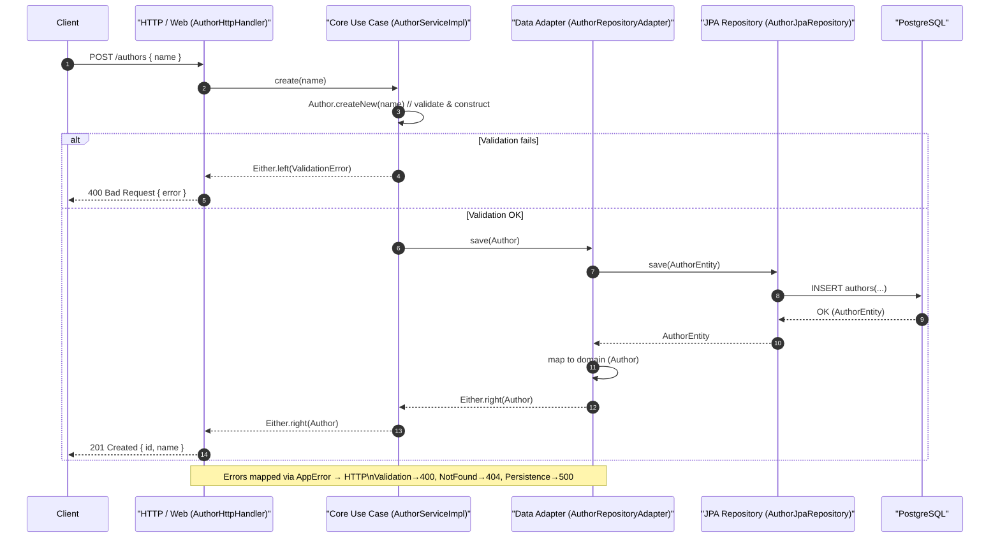

# Hexagonal Architecture – From Layered to Ports & Adapters

**Audience**: Java team migrating a legacy WebSphere app to Spring Boot, wishing to keep frameworks at the edges.

**Speaker goal**: Show why classic layered architecture hurts over time, then introduce Hexagonal (Ports & Adapters) using the provided sample repo as a running example.

---

## Agenda

1. Baseline: Classic layered architecture
2. Where layered architecture shows cracks
3. Hexagonal architecture: core ideas
4. Mapping hexagonal concepts to this repo
5. End-to-end request flow (Create/Get Author)
6. Guardrails: Architecture tests & boundaries
7. Practical migration from WebSphere → Spring Boot
8. Demo script (run/tests)
9. Trade-offs & FAQs

---

## 1) Baseline: Layered Architecture

**Typical layers**

* Controller / Web
* Service / Business
* Repository / Persistence
* Database

**Properties**

* Dependencies point downward only (Web → Service → Repo → DB).
* Framework types often live in the lower layers and are exposed upward.



**Strengths**

* Easy to start, low ceremony.
* Well known to Java teams.

**Weaknesses** (explored next)

---

## 2) Where Layered Architecture Shows Cracks

### 2.1 Framework(s) leaks through the layers

* Lower-layer changes ripple upward (e.g., repository now returns Spring Data `Page<T>`), forcing upper layers to import those types or write glue everywhere.
* **Example (Java):**

```java
// Repository layer change introduces Spring Data types
import org.springframework.data.domain.Page;
import org.springframework.data.domain.Pageable;

interface AuthorJpaRepository {
    Page<AuthorEntity> findByName(String name, Pageable pageable);
}

// Service layer is now forced to depend on Spring Data to expose pagination
import org.springframework.data.domain.Page;
import org.springframework.data.domain.PageRequest;

class AuthorService {
    private final AuthorJpaRepository repo;
    AuthorService(AuthorJpaRepository repo) { this.repo = repo; }

    Page<AuthorEntity> search(String name, int page, int size) {
        var pageable = PageRequest.of(page, size);
        return repo.findByName(name, pageable);
    }
}

// Web layer, in turn, ends up returning framework-shaped types
import org.springframework.web.bind.annotation.*;

@RestController
@RequestMapping("/authors")
class AuthorController {
    private final AuthorService service;
    AuthorController(AuthorService service) { this.service = service; }

    @GetMapping
    Page<AuthorEntity> search(@RequestParam String name,
                              @RequestParam int page,
                              @RequestParam int size) {
        return service.search(name, page, size);
    }
}
```

* **Consequence:** A persistence-layer decision (Spring Data pagination) ripples up into service and web signatures, increasing blast radius for change.

### 2.3 Testing drag

* Because services depend on framework types, unit tests often require more ceremony than you would want.

### 2.4 Architecture doesn’t enforce boundaries

* You *can* be disciplined in layered architecture, but the architecture doesn’t protect you. Short-term convenience often wins unless boundaries are continuously policed.

---

## 3) Hexagonal Architecture (Ports & Adapters)

**Core ideas**

* Domain & use cases in the center.
* Ports define what the core needs/offers.
* Adapters implement ports for technologies (HTTP, DB, MQ).
* Dependency rule: edges depend on the center, never the other way around.



**Benefits**

* Protects domain from frameworks.
* Migration easier (swap adapters).
* Tests run fast without containers/frameworks.
* Architecture makes the **easy path the correct one**.

---

## 4) Sample Repo: Mapping Modules

* **domain**: business language & invariants (`Author`, `AppError`, `AuthorServicePort`).
* **core**: orchestrates use cases (`AuthorServiceImpl`).
* **web**: HTTP adapter (`AuthorHttpHandler`, DTOs, error mapping).
* **data**: persistence adapter (`AuthorRepositoryAdapter`, JPA entity, mapper).
* **application**: Spring Boot composition root (wiring beans & routes).



---

## 5) End-to-End Flow (Create Author)

1. `web.AuthorHttpHandler` parses JSON → calls `AuthorServicePort.create`.
2. `core.AuthorServiceImpl` validates domain object → calls `AuthorRepositoryPort.save`.
3. `data.AuthorRepositoryAdapter` saves via JPA → maps back to domain.
4. Errors mapped through sealed `AppError` hierarchy to HTTP codes.

**Key:** `Author` enforces invariants. `AuthorServiceImpl` orchestrates use cases. Domain never imports JPA or Spring.


---

## 6) Guardrails

* **ArchUnit tests** enforce: domain/core cannot import Spring/JPA/Web. Web/data cannot depend on Spring Boot.
* **Integration tests** in application with Testcontainers + DBUnit.
* **Unit tests** run fast in core/web/data modules with mocks.

---

## 7) Migration Path: WebSphere → Spring Boot

* Existing app avoided WebSphere types in logic: good starting point.
* Apply same discipline: keep Spring at edges.
* Define ports first, then add adapters.
* Composition root (Spring Boot module) wires everything.
* Strangler pattern possible for gradual migration.

---

## 8) Demo Script

**Start DB**

```bash
docker compose up -d
```

**Run app**

```bash
mvn -f application spring-boot:run
```

**Create author**

```bash
curl -i -X POST localhost:8080/authors -d '{"name": "Douglas Adams"}' -H 'Content-Type: application/json'
```

**Get author**

```bash
curl -i localhost:8080/authors/<id>
```

---

## 9) Trade-offs & FAQs

* **Layered faster for tiny throwaway microservices**: low ceremony.
* **But as services grow**, hexagonal pays off by enforcing maintainability.
* **Architecture discipline**: layered relies on self-restraint; hexagonal makes the safe path the natural one.

---

### Closing

Layered architecture served well in the microservice “fast and disposable” era. But as services have grown larger and stickier, the cost of framework leakage and migration drag hurts. Hexagonal makes boundaries explicit and pushes frameworks to the edges — making the right design the easy design.
