```mermaid
classDiagram
    direction LR

    class IncomingStream~T~ {
      +elements() Flow~T~
    }
    class OutgoingStream~T~ {
      +emit(values: Flow~T~) Result~Long~
    }
    class IncomingBatch~T~ {
      +read(exec: BatchExecution) Flow~T~
    }
    class OutgoingBatch~T~ {
      +write(exec: BatchExecution, values: Flow~T~) Result~Long~
    }

    class BatchExecution {
      +id: String
      +windowStartEpochMs: Long
      +windowEndEpochMs: Long
    }

    class EngineConfig {
      +engineId: String
      +artifactClass: String
      +streams: StreamsSection
      +batches: BatchesSection
      +profiles: Profiles
    }

    class StreamsSection {
      +incoming: List~IncomingStreamCfg~
      +outgoing: List~OutgoingStreamCfg~
    }

    class IncomingStreamCfg {
      +name: String
      +bindTo: String
      +kafka: KafkaIncomingBinding
    }

    class OutgoingStreamCfg {
      +name: String
      +kafka: KafkaOutgoingBinding
    }

    class Profiles {
      +kafka: Map~String, KafkaProfile~
    }

    class KafkaIncomingBinding {
      +topic: String
      +profile: String
      +propsOverride: Map~String, Any~
    }
    class KafkaOutgoingBinding {
      +topic: String
      +profile: String
      +propsOverride: Map~String, Any~
    }
    class KafkaProfile {
      +common: Map~String, Any~
      +consumer: Map~String, Any~
      +producer: Map~String, Any~
    }

    EngineConfig --> StreamsSection
    EngineConfig --> Profiles
    StreamsSection --> IncomingStreamCfg
    StreamsSection --> OutgoingStreamCfg
    IncomingStreamCfg --> KafkaIncomingBinding
    OutgoingStreamCfg --> KafkaOutgoingBinding
    Profiles --> KafkaProfile
```

# Hexagonal Architecture: Designing for Change

> “The Universe operates on a basic principle of economics: everything has its cost. We pay to create our future, we pay 
> for the mistakes of the past. We pay for every change we make … and we pay just as dearly if we refuse to change.”

*Brian Herbert & Kevin J. Anderson, Dune: House Harkonnen*

---

## Agenda

Agenda
1.  Costs of change
2.	Hexagonal architecture: core ideas
3.	Hexagonal in practice: rules, modules, boundaries
4.	Mapping to the sample repo
5.	Testing in Hexagonal architecture
6.	When to choose Hexagonal

---

## 1) Costs of change
* Long-lived systems pay a “change tax”: frameworks evolve, infra moves, UIs shift, databases swap.
* Organize code so mistakes are cheap and technology migrations don’t cascade.
* Decouple your core logic from infrastructure so testing becomes easy without (too much) mocking.

**Key principle**: Make the cost of doing the right thing lower than the cost of doing the wrong thing.

---

## 2) Hexagonal architecture: core ideas

> Allow an application to equally be driven by users, programs, automated test or batch scripts, and to be developed and
> tested in isolation from its eventual run-time devices and databases.

*Alistair Cockburn, “Hexagonal architecture“*

- **Origin**: Alistair Cockburn’s “Ports & Adapters”.
- **Center**: Core business logic (domain + use cases) is independent from external dependencies, such as frameworks, 
databases, HTTP/message brokers, or UI. This makes the core logic easier to test and maintain.
- **Ports**: Abstract interfaces describing what the core needs (driven/outbound) or offers (driving/inbound).
  - **Driving**: specifies how the domain can be used.
  - **Driven**: specifies what functionality the domain needs.
- **Adapters**: Technology-specific implementations (HTTP controllers, JPA, messaging, CLI).
  - **Driving**: converts requests from a specific technology to the domain.
  - **Driven**: converts calls from the domain into specific technology terms.
- **Dependency rule**: Edges depend on the center, never the other way around.

---

## 3) Hexagonal in practice: rules, modules, boundaries

**Rules of thumb**
1.	Domain knows business language and invariants; no imports from Spring/JPA/HTTP.
2.	Use cases orchestrate workflows through ports; they depend only on domain + ports.
3.	Adapters translate: HTTP ↔ DTOs ↔ domain; JPA ↔ entities ↔ domain.
4.	Composition root (Spring Boot) wires adapters to ports.
5.	Contracts (ports) encode change boundaries.

**Typical module layout**
* domain: entities/value objects, errors, ports (interfaces).
* core: use case implementations (pure Java).
* web: HTTP adapter (handlers/controllers, DTOs, error mapping).
* data: persistence adapter (JPA entities/repos, mappers).
* application: Spring Boot wiring, routes, config.

---

## 4) Mapping to the sample repo

* Driving adapter: AuthorHttpHandler, RoyaltyHttpHandler (web).
* Driving port: LibraryServicePort, RoyaltyServicePort (domain defines).
* Use cases: LibraryServiceImpl, RoyaltyServiceImpl (core implements).
* Driven ports: AuthorRepositoryPort, BookRepositoryPort, SaleRepositoryPort, SalesReportingPort (domain defines).
* Driven adapters: AuthorRepositoryAdapter, BookRepositoryAdapter, SaleRepositoryAdapter, SalesReportingAdapter (data implements).
* Wiring: BeansConfig (application) connects adapters ↔ ports, installs error filter, routes.


**20,000 feet overview**


---

## 5) Testing in Hexagonal architecture

* **ArchUnit tests** enforce: domain/core cannot import Spring/JPA/Web. Web/data cannot depend on Spring Boot.
* **Integration tests** in application module with Testcontainers + DBUnit.
* **Unit tests** run fast in core/web/data modules with mocks.

### 5.1) What to test in each module
* domain (unit tests): validate domain stays independent of any frameworks.
* core (unit tests): business logic validation and port orchestration.
* web (unit tests): DTO↔domain & error mapping.
* data (unit tests): entity↔domain mappers.
* application (integration tests): Spring Boot + Testcontainers Postgres + Liquibase; hit real HTTP routes and DB.

---

## 6) When to choose Hexagonal

Great fit when:
* The system is long-lived
* The system is non-trivial

Long-lived and non-trivial services need to be ready to anticipate changes to underlying frameworks and other technology.

When a service is small or you expect to retire a service within the current hype-cycle then maybe Hexagonal is overkill.
In such cases a traditional layered architecture could be the better approach. 

### 6.1) Where Layered Architecture Shows Cracks

Lower-layer changes ripple upward (e.g., repository now returns Spring Data `Page<T>`), forcing upper layers to import 
those types or write glue everywhere.

**Example:**

```java
// Repository layer change introduces Spring Data types
import org.springframework.data.domain.Page;
import org.springframework.data.domain.Pageable;

interface AuthorJpaRepository {
    Page<AuthorEntity> findByName(String name, Pageable pageable);
}

// Service layer is now forced to depend on Spring Data to expose pagination
import org.springframework.data.domain.Page;
import org.springframework.data.domain.PageRequest;

class AuthorService {
    private final AuthorJpaRepository repo;
    AuthorService(AuthorJpaRepository repo) { this.repo = repo; }

    Page<AuthorEntity> search(String name, int page, int size) {
        var pageable = PageRequest.of(page, size);
        return repo.findByName(name, pageable);
    }
}

// Web layer, in turn, ends up returning framework-shaped types
import org.springframework.web.bind.annotation.*;

@RestController
@RequestMapping("/authors")
class AuthorController {
    private final AuthorService service;
    AuthorController(AuthorService service) { this.service = service; }

    @GetMapping
    Page<AuthorEntity> search(@RequestParam String name,
                              @RequestParam int page,
                              @RequestParam int size) {
        return service.search(name, page, size);
    }
}
```

* **Consequence:** A persistence-layer decision (Spring Data pagination) ripples up into service and web signatures, increasing blast radius for change.


---





